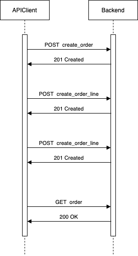

# How it was developed

## Index

- [Specs](/README.md) 
- [Instructions](/docs/instructions.md) 
- [How it was developed](/docs/how-it-was-developed.md) 
- [API doc](/docs/api/orders.md) 

## Overview

I typically use the term MVP to referer to a project which validates an idea or path and evolves the system based on the feedback retrieved. **But here the MVP (idea and system) is already validated.**. Following this meaning, in my humble opinion, this implementation is a solution over-engineered for an MVP phase in terms of software architecture. Probably, for this phase, having hard coupling with Django/Django Rest Framework is enough so the project will gain better learning and adapting curve and faster development/iteration.

## Hey guy! Are you versioning `.vscode` folder?

For good organization I encapsulate everything under `folder`. So, it produces my IDE doesn't understand where/what are the packages and classes. For that, I needed to add the `autoComplete.extraPaths`.

Assuming you will clone this repository, I versioned this file to notify you probably your IDE will need as well.

In a real project, I'm never versioning an IDE configuration file.

## Dockerizing

The challenge has been developed using `Docker` and `Docker Compose`. I have created two different containers using `Docker multi-stage`. So, you can find the deploy version in `app` container and the version for running tests in `app_test`.

## Using flake8 and isort

As part of my daily work, I'm very familiar with `flake8` and `isort` tools. These tools help us as developers to type maintainable and readable code. I'm checking these tools in my CI pipeline.

## API work flow

## Data models

I'm not very proud of this data model but I needed to go forward. I'm not very proud because I think there are more easy solutions but... I don't found it yet.

The data models I built are resilient in terms of product changes. I mean, In a real business products evolve (its prices, names, options prices, option name,...) so in each `OrderLine` I'm storing the snapshot of those fields.

## Testing

I mainly have 2 types of tests: acceptance (e2e) and unit. You can found the tests E2E under the folder `api/orders/tests`. On the other hand, you can found unittest under the folders `orders/tests`.

I usually work using the philosophy `TDD` but in challenges, in my opinion, is really hard because I'm building all things. Anyway, `TDD` is something I like to follow.

Finally, I have a really fat test (my real scenario). You can found it here `api/orders/tests/test_real_scenario`.

## Django rest framework

`DRF` is the framework used to route the request to its proper view. Also, I used its serializers to validate requests, i.e. the add order line request.

Probably, in a real system is necessary some kind of authentication, could be managed by `DRF`.

## Offers checker

Each offer has a conditions field which is a JSON with:

*Days of the week:* list of the days of the week to check if the offer has to be applied.

*Combine options:* combinations of `product_id`, `product_option_id`, and `quantities`. All combine options have to be present in the order to apply the offer

Every time an order line is added, the system calculates the subtotal of the line and calculates the total order taking into account the offers.

## Software architecture

##### Hexagonal architecture

I have structured the challenge thinking in `Hexagonal architecture`. I splited everything in 3 folders: `application` (use cases), `domain` (bussines logic) and `infrastructure` (integrations).

##### Uses Cases

Each use case is separated in its folder: `create_order`, `delete_order`, ...

You can found it in `orders/application/`

##### Repository pattern

A synonym of `Hexagonal architecture` is `Ports & Adapters architecture` so is essential to have this pattern and injecting the ports in uses cases. Using it, we are decoupling the app from `Django` / `MySQL` and allow us to have others adapters (`elasticsearch` / `SQLAlchemy` / ...) and we could replace one for other relatively easy. Also, I'm aplying `DIP` (Dependency Inversion Principle) in uses cases.

##### Entities

To put the business logic in the right place I needed to have `Entities`. It allows us to push the offer logic to the `Entity`.

Repositories talk with its implementation, DjangoOrderRepository talks with Django, but always return `Entities`.

##### Value objects

When a request comes to its use case, it validates some data using `Value objects`. Is good to have this kind of place because it allows pushing the validation logic to these files.

I'm not using a lot of these `Value objects` here but I wanted to show this knowledge.

##### Custom exceptions

To give more semantic to errors under control I have created custom exceptions so other co-workers can understand quickly what's happening.

##### Introducing to CQRS

I'm not implementing the `CQRS pattern` but I did some movement, i.e. the API expects UUIDs instead of delegating the creation in `Django`. Ideally, endpoints like `create_order`, `create_order_line`, `delete_...`, will be commands so I'm returning an empty body in the response.

Moreover, I structure the use cases in a way that favors the switch to `Commands` / `Queries`.
